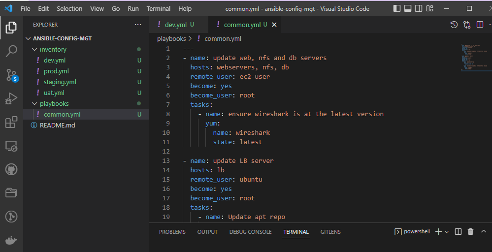
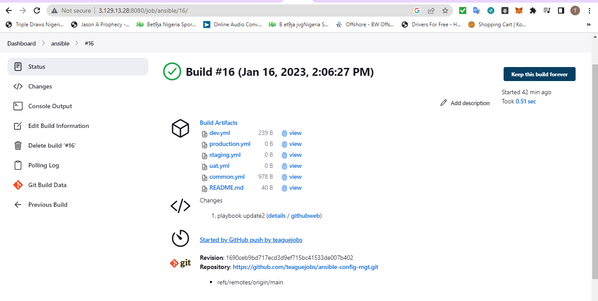

**INSTALL AND CONFIGURE ANSIBLE ON EC2 INSTANCE**

1. Update Name tag on your Jenkins EC2 Instance to Jenkins-Ansible. We will use this server to run playbooks

2. In your GitHub account create a new repository and name it ansible-config-mgt.

3. Instal Ansible
`sudo apt update`
`sudo apt install ansible`

- Check your Ansible version by running
`ansible --version`

4. Configure Jenkins build job to save your repository content every time you change it – this will solidify your Jenkins configuration skills acquired in Project 9.

- open our jenkins server url and create a new freestyle project ansible
- Goto source code management and enter our repo url
- On build triggers section select GitHub hook trigger for GITScm polling
- Copy our jenkins url and configure webhook on our ansible-config-mgt repo

- Add build steps select Archive the artifacts then `**`
- Remember to change our branch to `*/main`
- Build success

5. Test your setup by making some change in README.MD file in master branch and make sure that builds starts automatically and Jenkins saves the files (build artifacts) in following folder

`ls /var/lib/jenkins/jobs/ansible/builds/<build_number>/archive/`

- Note: Trigger Jenkins project execution only for /main (master) branch.

- Tip Every time you stop/start your Jenkins-Ansible server – you have to reconfigure GitHub webhook to a new IP address, in order to avoid it, it makes sense to allocate an Elastic IP to your Jenkins-Ansible server (you have done it before to your LB server in Project 10). Note that Elastic IP is free only when it is being allocated to an EC2 Instance, so do not forget to release Elastic IP once you terminate your EC2 Instance.

**Step 2 – Prepare your development environment using Visual Studio Code**

1. Install and configure it to connect to your newly created GitHub repository.(ansible-config-mgt)
2. Install Remote development pack extension on our vscode
3. Clone down your ansible-config-mgt repo to your Jenkins-Ansible instance
`git clone <ansible-config-mgt repo link>`

**BEGIN ANSIBLE DEVELOPMENT**

1. In your ansible-config-mgt GitHub repository, create a new branch that will be used for development of a new feature.
`git checkout -b prj-11`

2. Checkout the newly created feature branch to your local machine and start building your code and directory structure
3. Create a directory and name it playbooks – it will be used to store all your playbook files.
4. Create a directory and name it inventory – it will be used to keep your hosts organised.
5. Within the playbooks folder, create your first playbook, and name it common.yml
6. Within the inventory folder, create an inventory file (.yml) for each environment (Development, Staging Testing and Production) dev, staging, uat, and prod respectively.

**Step 4 – Set up an Ansible Inventory**

- An Ansible inventory file defines the hosts and groups of hosts upon which commands, modules, and tasks in a playbook operate. Since our intention is to execute Linux commands on remote hosts, and ensure that it is the intended configuration on a particular server that occurs. It is important to have a way to organize our hosts in such an Inventory.
- Save below inventory structure in the inventory/dev file to start configuring your development servers. Ensure to replace the IP addresses according to your own setup.
**Note: Ansible uses TCP port 22 by default, which means it needs to ssh into target servers from Jenkins-Ansible host – for this you can implement the concept of ssh-agent. Now you need to import your key into ssh-agent:**
`eval`ssh-agent -s'
`ssh-add <path-to-private-key>`

- Having added our private key to ssh agent ,we can now ssh into our instance using the following command
`ssh - A ubuntu@public.ip`
- Confirm the key has been added with the command below, you should see the name of your key
- `ssh-add -l`
- 
- Create 4 RHEL-Based server (NFS,DB,2 WEBSERVERS) &1 ubuntu server as load balancer

- We need to verify if our instances can be accessed from our Jenkins-Ansible server and add each of them as known hosts so as to enable ansible connect with them
- ssh into our Jenkins-ansible server
`ssh ec2-user@private.ip NFS SERVER`
`ssh ec2-user@private ip webservers`
`ssh ec2-user@privateip DB SERVER`
`ssh ubuntu@privateip load balancer`

**Update your inventory/dev.yml file with this snippet of code:**

`[nfs]
<NFS-Server-Private-IP-Address> ansible_ssh_user='ec2-user'

[webservers]
Web-Server1-Private-IP-Address ansible_ssh_user='ec2-user'
Web-Server2-Private-IP-Address ansible_ssh_user='ec2-user'

[db]
Database-Private-IP-Address ansible_ssh_user='ec2-user'

[lb]
Load-Balancer-Private-IP-Address ansible_ssh_user='ubuntu'`

**Step 5 – Create a Common Playbook**

- It is time to start giving Ansible the instructions on what you needs to be performed on all servers listed in inventory/dev
- In common.yml playbook you will write configuration for repeatable, re-usable, and multi-machine tasks that is common to systems within the infrastructure.
- Update your playbooks/common.yml file with following code:

`---

- name: update web, nfs and db servers
  hosts: webservers, nfs, db
  remote_user: ec2-user
  become: yes
  become_user: root
  tasks:
  - name: ensure wireshark is at the latest version
      yum:
        name: wireshark
        state: latest

- name: update LB server
  hosts: lb
  remote_user: ubuntu
  become: yes
  become_user: root
  tasks:
  - name: Update apt repo
      apt:
        update_cache: yes

  - name: ensure wireshark is at the latest version
      apt:
        name: wireshark
        state: latest`

**Step 6 – Update GIT with the latest code**

- Now all of your directories and files live on your machine and you need to push changes made locally to GitHub.

- In the real world, you will be working within a team of other DevOps engineers and developers. It is important to learn how to collaborate with help of GIT. In many organisations there is a development rule that do not allow to deploy any code before it has been reviewed by an extra pair of eyes – it is also called "Four eyes principle".

- Now you have a separate branch, you will need to know how to raise a Pull Request (PR), get your branch peer reviewed and merged to the master branch.

- Commit your code into GitHub:

1. Create a new branch on your integrated terminal on vsode and name it prj-11.
`git checkout -b prj-11`

2. use git commands to add, commit and push your branch to GitHub.
`git status`
`git commit -m "message"`
`git push origin prj-11`

3. Create a Pull request (PR)
4. Wear a hat of another developer for a second, and act as a reviewer.

5. If the reviewer is happy with your new feature development, merge the code to the master branch.

- Once your code changes appear in master branch – Jenkins will do its job and save all the files (build artifacts) to `/var/lib/jenkins/jobs/ansible/builds/build_number/archive/` directory on Jenkins-Ansible server.

**Step 7 – Run first Ansible test**

- Now, it is time to execute ansible-playbook command and verify if your playbook actually works:

- Connect to our Jenkins-Ansible host on our vscode using our remote-ssh extension.
- insert this on our ssh config file
`Host Jenkins-Ansible
    HostName ec2-18-216-225-81.us-east-2.compute.amazonaws.com
    User ubuntu
    IdentityFile /Users/HP/Downloads/new1.pem
    ForwardAgent true
    ControlPath /tmps/ansible-ssh-%%h-%%p-%%r
    ControlMaster auto
    ControlPersist 10m`

- Now run the command on our Jenkins-Ansible Server from our last successful build
`ansible-playbook -i /var/lib/jenkins/jobs/ansible/builds/13/archive/Inventory/dev.yml /var/lib/jenkins/jobs/ansible/builds/13/archive/playbooks/common.yml`

- Note if we experience any issues running playbook sucessfully , Edit our ansible config file and add the following
`sudo vi /etc/ansible/ansible.cfg`
`ssh_args = -o UserKnownHostsFile=/dev/null -o StrictHostKeyChecking=no`

- You can go to each of the servers and check if wireshark has been installed by running which wireshark or wireshark --version

- Optional step – Repeat once again
Update your ansible playbook with some new Ansible tasks and go through the full checkout -> change codes -> commit -> PR -> merge -> build -> ansible-playbook cycle again to see how easily you can manage a servers fleet of any size with just one command!

- first we update our playbook/common.yml file on prj-11 branch

- We commit our changes to our repo

- change back to main branch and then `git pull`

- Now check our jenkins for the latest build , will notice its been updated with the latest changes

- Now run playbook using this command :
`ansible-playbook -i /var/lib/jenkins/jobs/ansible/builds/16/archive/Inventory/dev.yml /var/lib/jenkins/jobs/ansible/builds/16/archive/playbooks/common.yml`

- Verify by checking our nfs server

- **Congratulations
You have just automated your routine tasks by implementing your first Ansible project**

